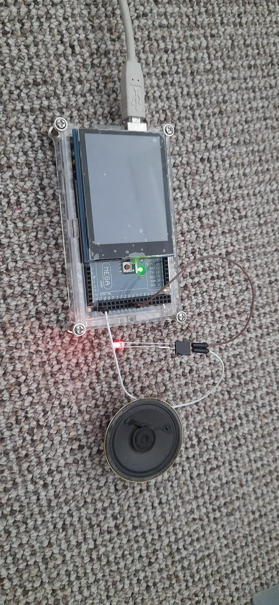

# Object Oriented Music Player

###### with optional loading of images during songs
 

## Parts:
* Arduino MEGA 2560
(only if you have `USE_IMAGERY` set to 1, otherwise an Uno should be enough)
* A buzzer/speaker
    * Something to decrease power that goes to the buzzer/speaker if necessary (I used a LED)
* A [2.8'' TFT LCD shield w/Cap Touch and microSD](https://www.adafruit.com/product/1947) if you set `USE_IMAGERY` to 1
(anything that works with ILI9341 should work) (touch screen isn't used)
    * But no screen is necessary if `USE_IMAGERY` is 0

## Setup:
1. Attach the TFT to the top of the arduino
1. Connect your buzzer
1. Change your settings in settings.h
    * `DEBUG`: whether or not to serial print debug messages
    * `USE_IMAGERY`: whether or not to enable tft and sd usage
    * `BUZZERS`: pin of your buzzer
    * `SD_CS`: if you have `USE_IMAGERY` set to 1 and your microSD uses a different pin/port
    * `BRIGHTNESS`: 0-255 for the backlight strength (if you have `USE_IMAGERY` set to 1)
1. Choose a song by setting `CHOSEN_SONG` in songs.h (not all songs are finished/correctly entered)
1. Upload images for songs to the SD (if `USE_IMAGERY` is 1)
1. Upload the sketch
1. Enjoy the music :)

[Video](https://youtu.be/i3_2w644NWw)
